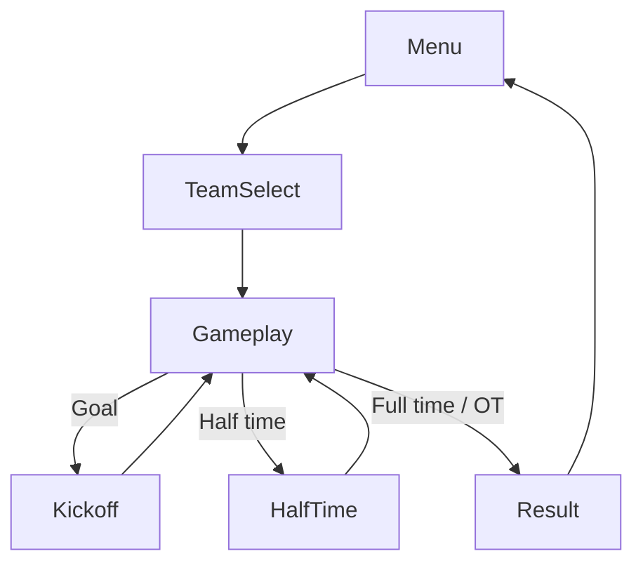

# GDD — Football Legends

> v1: **1v1 Friendly** — human vs AI. Chi tiết kỹ thuật: `03-ARCHITECTURE.md` · Thuật ngữ: `CONTEXT.md` · Source gốc: `SOURCE-REFERENCE.md`

## Tổng quan

| Mục | Nội dung |
|-----|----------|
| Tên project | Football Legends |
| Thể loại | Arcade bóng đá 2D side-view |
| Nền tảng | Web / playable ads |
| Engine | Cocos Creator 3.x |
| Nguồn tham chiếu | Phaser build gốc (MADPUFFERS 2019) — xem `SOURCE-REFERENCE.md` |

## Core loop

1. **Menu** — người chơi chọn Friendly Match.
2. **TeamSelect** — chọn đội (24 club) và 1 trong 2 nhân vật (Fireball hoặc Teleport).
3. **Gameplay** — trận 1v1: human (trái) vs bot (phải), 2 hiệp, có super ability.
4. **Kết quả** — hiển thị tỉ số; quay Menu hoặc rematch.

## Mechanics chính

| Mechanic | Mô tả ngắn |
|----------|------------|
| Di chuyển | Chạy trái/phải trên sân 2D |
| Nhảy | Nhảy + double jump để chạm bóng trên không |
| Sút | Sút khi bóng trong vùng 80×80 px |
| Tackle | Tắc bóng — stun đối thủ trong vùng 40×50 px (~80% chance, 1s) |
| Super — Fireball | Nhân vật slot 1: sút mạnh ×1.8, slow-mo 3s |
| Super — Teleport | Nhân vật slot 2: dịch chuyển tới bóng rồi sút |
| Energy | Thanh nạp theo thời gian; kích hoạt khi đủ 12 điểm; giữ qua hiệp 2 |
| Timer | 2 hiệp × 45 phút (hiển thị); hòa hiệp 2 → overtime (bàn thắng vàng) |
| AI | Bot 1 cầu thủ, skill 0.3, chiến thuật theo tỉ số |
| Goal | Slow-mo + "GOAL!!!" → kickoff sau 1.5s |

## Super ability (theo nhân vật)

Mỗi đội có 2 nhân vật; super gắn cố định theo slot:

| Slot | Super | Mô tả gameplay |
|------|-------|----------------|
| Nhân vật 1 | **Fireball** | Sút cực mạnh, bóng trail, slow-mo toàn trận 3 giây |
| Nhân vật 2 | **Teleport** | Thu nhỏ → dịch tới gần bóng → sút (slow-mo ngắn 1s) |

- Human chọn nhân vật trước trận → quyết định super của mình.
- Bot random nhân vật 1 hoặc 2 — hiển thị super trên màn chọn; **v1 bot không tự kích hoạt super** (AI gốc không có logic này).

## Controls

| Hành động | Desktop | Mobile |
|-----------|---------|--------|
| Di chuyển | A / D | Virtual ← → |
| Nhảy | W | Virtual ↑ |
| Sút | X hoặc B | Nút sút |
| Tackle | S hoặc ↓ | Nút tackle |
| Super | Z hoặc K | Nút super |

## UI / Scene chính

| Scene | Mục đích |
|-------|----------|
| Boot | Preload asset (sân, player, UI, audio) |
| Menu | Nút Play Friendly |
| TeamSelect | Chọn 2 đội; human chọn nhân vật + xem super; preview bot |
| Gameplay | Trận đấu + HUD (tỉ số, timer, energy bar) |
| *(overlay)* | Countdown, Half Time, Full Time / Result |

## Ràng buộc kỹ thuật

| Mục | Mục tiêu |
|-----|----------|
| Logic timestep | ~40 FPS logic (STEP 0.025s gốc) |
| Physics tuning | Hằng số trong component (tham chiếu giá trị gốc `SOURCE-REFERENCE.md`) |
| Ngôn ngữ | TypeScript strict |
| Animation | Port từ DragonBones → Spine hoặc skeletal Cocos (ADR khi chọn) |

## Out of scope (v1)

- Tournament / Championship bracket
- Quick Match (random teams)
- 2v2, matchMode 2v2 co-op
- 2 người chơi local (2P)
- Bot kích hoạt super ability
- Save/load giải đấu, achievements, stats
- Ads SDK, online leaderboard

---

Chi tiết kỹ thuật: `03-ARCHITECTURE.md` · Thuật ngữ: `CONTEXT.md`
