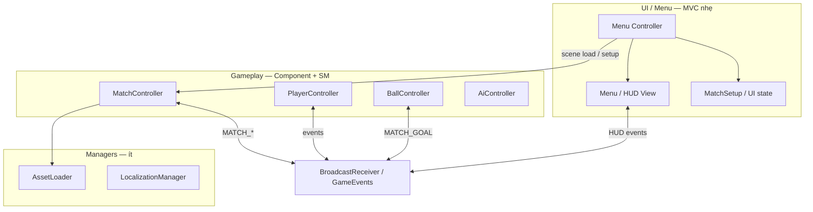
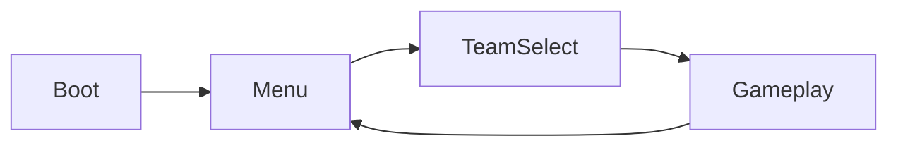
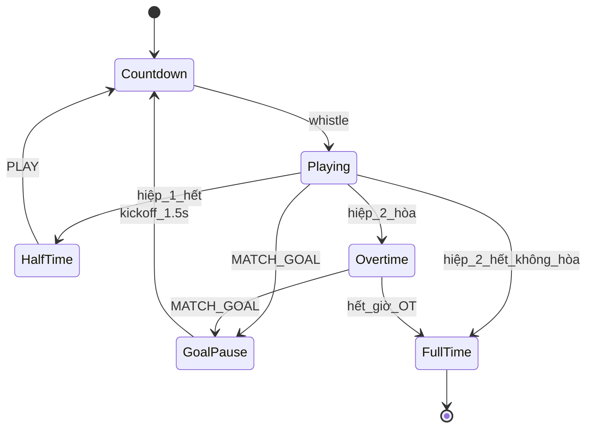
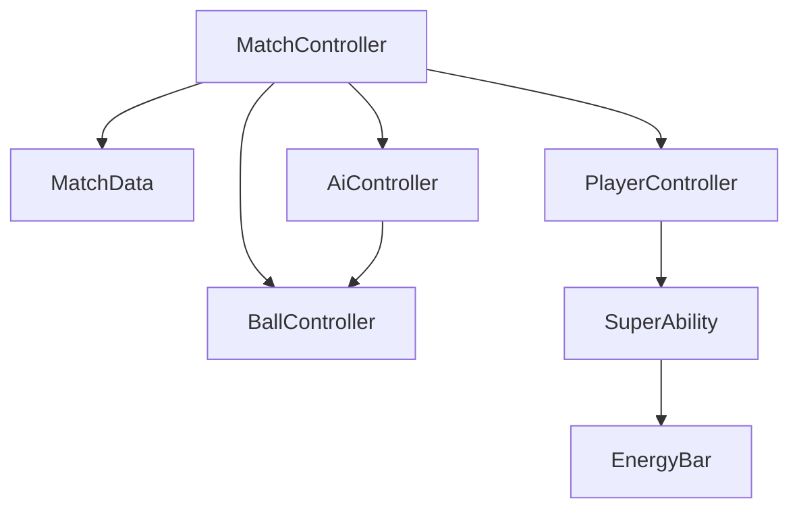

# Architecture — Pattern & hệ thống

> v1: **1v1 Friendly**. Cập nhật khi ADR hoặc feature thay đổi kiến trúc.

## Stack kiến trúc (đã chọn)

| Lớp | Pattern | Phạm vi | Ghi chú |
|-----|---------|---------|---------|
| Khung xương | **Component-Based** | Gameplay + mọi node logic | `@ccclass`, lifecycle Cocos, inject `@property` |
| Hệ thống toàn cục | **Manager** (ít, có kiểm soát) | Asset, i18n, network… | Không Manager cho move/shoot/AI |
| Liên lạc lỏng | **Event Bus** | Cross-module | `BroadcastReceiver` + `GameEvents` |
| Hành vi & luồng trận | **State Machine** | Match / Player / Ball | `MatchPhase`, `PlayerState`, `BallState` |
| UI / Menu | **MVC nhẹ** | Menu, TeamSelect, HUD, popup | Model = data/setup; View = node UI; Controller = component menu |



### Quy tắc phân tầng

| Được | Không |
|------|------|
| Component sở hữu logic gắn node (player, ball, match) | Singleton gameplay global (`Game.instance.movePlayer…`) |
| Manager chỉ cho dịch vụ toàn cục, số lượng ít | Thêm Manager mỗi feature gameplay |
| Event bus cho goal, pause, energy, scene signal | Event thay thế mọi gọi trực tiếp trong cùng cụm (ưu tiên `@property` ref) |
| State machine rõ ràng cho phase trận + hành vi | Boolean flag rải rác thay state |
| MVC nhẹ **chỉ** UI/Menu | MVC hóa toàn bộ gameplay |

## Nguyên tắc

| Nguyên tắc | Mô tả |
|------------|-------|
| Component-first | Logic gắn node qua `@ccclass`; khung xương chính |
| Manager có kiểm soát | Chỉ `managers/` + i18n; không phình Manager gameplay |
| Event-driven | Custom event qua `BroadcastReceiver` + `GameEvents` |
| State machine | Match / Player / Ball — enum + transition rõ |
| MVC nhẹ (UI) | Tách data UI ↔ view node ↔ controller menu |
| Inject qua `@property` | Reference scene/prefab do Human wire |
| Lifecycle strict | onLoad → start → onEnable → update → onDisable → onDestroy |
| Tuning trong component | Hằng số move/jump/shot trong code component (không file `ObjectsData`) |

## Cấu trúc thư mục script

Thư viện template ở **`scripts/`** (repo root). Human kéo file cần dùng vào `assets/scripts/` trong Editor.

```
scripts/
├── common/
│   ├── GameTypes.ts       # MatchPhase, SuperType, Side, IMatchSetup
│   ├── GameEvents.ts      # MATCH_GOAL, MATCH_SLOW_MO, …
│   └── BroadcastReceiver.ts
├── managers/
│   └── AssetLoader.ts     # Manager toàn cục (ít)
├── ui/                    # MVC nhẹ — View/Controller UI
│   └── popup/UiPopup.ts
├── gameplay/              # v1 core — Component + State Machine
│   ├── MatchController.ts # Vòng đời trận (thay FootballGameCore)
│   ├── MatchData.ts       # score, energies (model runtime trận)
│   ├── PlayerController.ts# Input human + PlayerState
│   ├── AiController.ts    # Bot 1v1
│   ├── BallController.ts  # Bóng + BallState
│   ├── SuperAbility.ts    # Fireball / Teleport
│   └── EnergyBar.ts       # UI nạp super
└── i18n/
    └── LocalizationManager.ts
```

Chi tiết file: `01-MODULES.md`.

## Luồng scene (v1)



Director / scene load do Human setup; chuyển scene qua **MVC nhẹ** (Menu/TeamSelect controller) → `MatchController`.

## Match lifecycle (State Machine)



Owner: `MatchController` — state nội bộ `MatchPhase`.

## Event Bus

| Event | Emitter | Listener(s) | Payload | Ghi chú |
|-------|---------|-------------|---------|---------|
| `MATCH_GOAL` | BallController / physics | MatchController, UI | `{ side: Side }` | side ghi bàn |
| `MATCH_END` | MatchController (timer) | UI overlay | `{ phase: HalfTime \| FullTime \| Overtime }` | |
| `MATCH_SLOW_MO` | SuperAbility, MatchController | MatchController, timeScale | `{ scale: number, duration?: number }` | 0 = bình thường, 3 = fireball |
| `MATCH_PAUSE` | UI pause btn | MatchController | — | |
| `MATCH_KICKOFF` | MatchController | PlayerController, AiController | — | Reset vị trí |
| `ENERGY_CHANGED` | EnergyBar | UI | `{ current: number, max: number }` | |

Map tín hiệu gốc (Phaser): `goalSignal`, `matchEndSignal`, `slowSignal`, `menuPauseSignal` — xem `SOURCE-REFERENCE.md`.

## State Machine — bảng state

| State | Enum | Owner | Chuyển khi |
|-------|------|-------|------------|
| Match phase | `MatchPhase` | `MatchController` | Timer, goal, UI |
| Ball | `BallState` | `BallController` | ground / shoot / head |
| Player | `PlayerState` | `PlayerController` | idle / run / jump / tackle / stun |
| Super | `SuperType` | `SuperAbility` | Fireball \| Teleport \| None |

## Component graph (Gameplay scene)



## Load tài nguyên

| Loại | Cách load | Path convention |
|------|-----------|-----------------|
| Sân collision | JSON trong resources | `assets/resources/data/Play1.json` |
| Player skins | JSON + atlas | `assets/resources/data/Players.json` |
| Prefab player/ball | resources.load | `assets/resources/prefabs/` |
| UI atlas | resources | `assets/resources/textures/` |
| Audio SFX | resources | `assets/resources/audio/` |

## Quyết định port (chưa ADR — chọn khi implement)

| Chủ đề | Gốc | Cocos (đề xuất) |
|--------|-----|----------------|
| Physics | Nape | Box2D builtin hoặc `@cocos/box2d` |
| Animation | DragonBones | Spine hoặc DragonBones Cocos runtime |
| Input mobile | Virtual pad Phaser | Node UI + touch events |

Ghi ADR trong `.cursor/docs/adr/` khi quyết định.

## Chuẩn code chi tiết

Skill: `.cursor/skills/theone-cocos-standards/`
